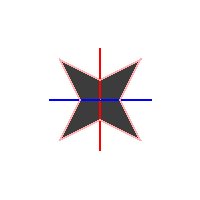
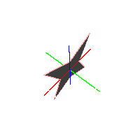
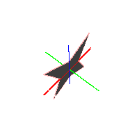
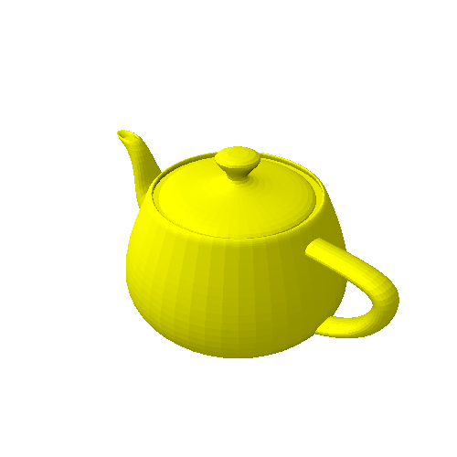

# [ccg-r3d](https://github.com/agdturner/ccg-r3d)
A Java library for rendering 3D spatial data based on [ccg-v3d]((https://github.com/agdturner/ccg-v3d)).

The aim is to support visualisation of models with [6 degrees of freedom](https://en.wikipedia.org/wiki/Six_degrees_of_freedom).

The focus is rendering geometry and data attributed to those geometries. The geometries derive from points, planes, lines, line segments (parts of lines), areas (bounded plane sections) and volumes (bounded by areas).

## Uses
* Helping explain and develop [ccg-v3d](https://github.com/agdturner/ccg-v3d) - the underlying 3D Euclidean geometry library.
* Visualising 3D data.
* Supporting the development of a digital twin Earth. A model of Earth that provides feedback for sensing and surveying it in order to more accurately and usefully represent it.

## Axes
The following image is a render of an area (a polygon with no internal holes) coloured gray, with a pink edge in a clear cube for which white edges are rendered as lines. This is looking down the Z axis with the axes coloured (X blue, Y red, Z green). The camera has a screen as wide as the cube which is positioned at a distance of the radius of the cube (distance from the centre to a corner) with a focus in line with the centre of the screen and at twice the radius of the cube:

The camera can be pointed at the geometry from anywhere. The  following image is a rendering after rotating the camera Pi/8 radians around the X axis, 13*Pi/8 radians around the Y axis and 10*Pi/8 radians around the Z axis:

Renderings have been produced for geometries defined by coordinates and calculation done with double precision floating point and [https://github.com/agdturner/ccg-math/blob/master/src/main/java/uk/ac/leeds/ccg/math/number/Math_BigRationalSqrt.java](Math_BigRationalSqrt). Some of the generated image files appear identical, none are radically different - any differences are subtle. For instance compare the following which was calculated with double precision with the above which was calculated with arbitrary precision to 6 decimal places.

A more detailed comparison of the generated images is wanted...

# NB: Various other renderings had been produced from STL files, but that work wants doing again so the results are reproducible using the latest version of the software...

## Hello World

Rendering of [Utah Teapot](https://en.wikipedia.org/wiki/Utah_teapot) using [Utah_teapot_(solid).stl](data/Utah_teapot_(solid).stl) with 9438 triangles (resolution 500x375, [Order of Magnitude](https://en.wikipedia.org/wiki/Order_of_magnitude) of precision -10), there is no shadow, there is effectively a low ambient light and a vector for a general light:

Rendering of the asteroid [Geographos](https://en.wikipedia.org/wiki/1620_Geographos) using a [Geographos 3D Model provided by NASA](https://nasa3d.arc.nasa.gov/detail/geographos) with 16380 triangles (resolution 500x375, [Order of Magnitude](https://en.wikipedia.org/wiki/Order_of_magnitude) of precision -8):

The images of the Geographos and the Utah Teapot were produced by running [RenderImage.java](https://github.com/agdturner/ccg-r3d/tree/main/src/main/java/uk/ac/leeds/ccg/r3d/RenderImage.java). As the underlying library changed, running this file does not currently reproduce these images..

The image below is a rendering of [Hurricane Katrina](https://en.wikipedia.org/wiki/Hurricane_Katrina) using a [Hurricane_Katrina 3D Model provided by NASA](https://nasa3d.arc.nasa.gov/detail/hurricane-katrina):

The image of Hurricane Katrina was produced by running [RenderImageDouble.java](https://github.com/agdturner/ccg-r3d/tree/main/src/main/java/uk/ac/leeds/ccg/r3d/d/RenderImageDouble.java). As the underlying library changed, running this file does not currently reproduce these images..

## Development plans/ideas
- Generate reproducible results.

## Contributing
- Thanks for thinking about this.
- If this is to form into a collaborative project, it could do with a Code of Conduct and Contributor Guidelines based on something like this: [Open Source Guide](https://opensource.guide/)

## LICENSE
- [APACHE LICENSE, VERSION 2.0](https://www.apache.org/licenses/LICENSE-2.0)
- Other licences are possible!

## Acknowledgements and thanks
- The [University of Leeds](http://www.leeds.ac.uk) has indirectly supported this work by employing me over the years and encouraging me to develop the skills necessary to produce this library.
- Thank you Eric for the [BigMath](https://github.com/eobermuhlner/big-math) library.

## Links
* [Various Printable 3D Models from NASA](https://nasa3d.arc.nasa.gov/models/printable) in [STL File Format](https://en.wikipedia.org/wiki/STL_(file_format)).
* [Wikipedia List_of_common_3D_test_models](https://en.wikipedia.org/wiki/List_of_common_3D_test_models).
* [The UK National Oceanography Centre Information Management Framework for Environmental Digital Twins (IMFe) Report](https://noc.ac.uk/files/documents/about/NOC%20IMFe%20Summary%20Report2.pdf)
