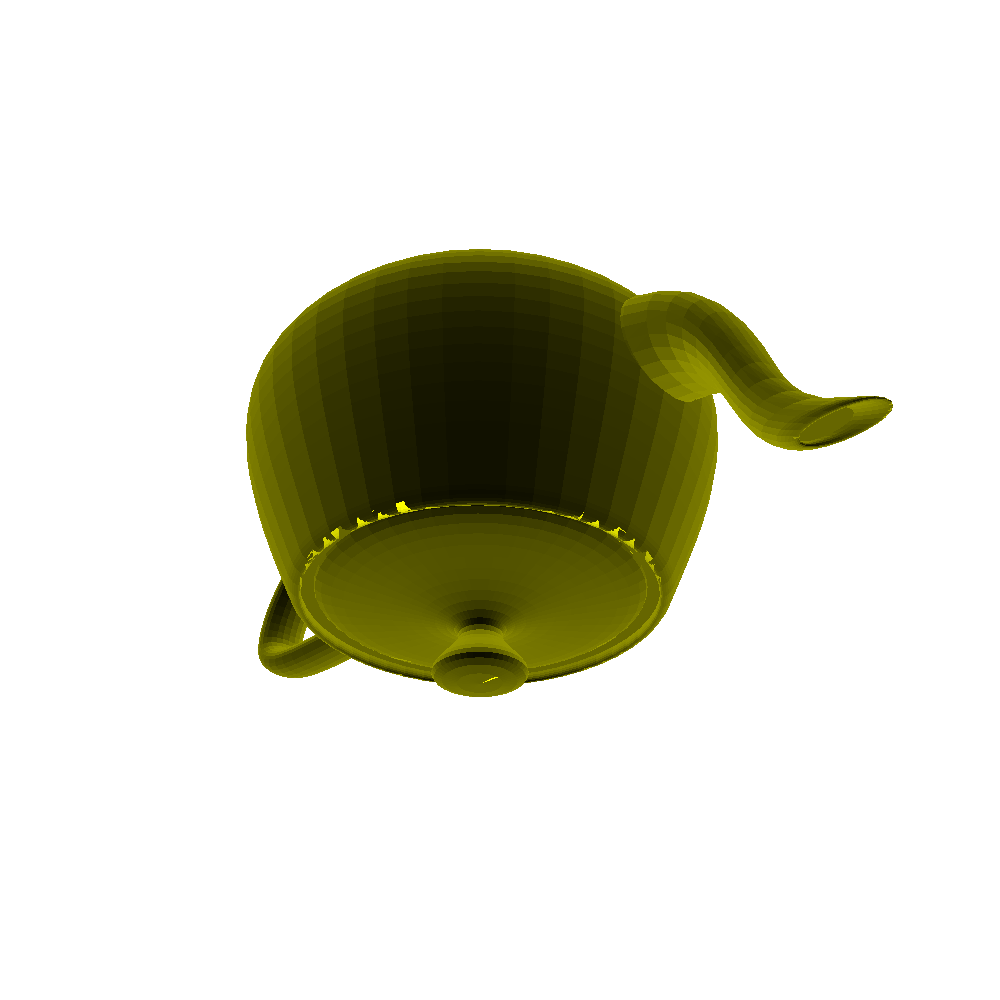
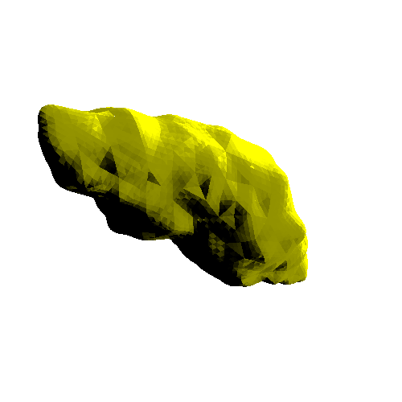

# [ccg-r3d](https://github.com/agdturner/ccg-r3d)
A Java library for rendering 3D spatial data. This is built on top of [ccg-v3d]((https://github.com/agdturner/ccg-v3d)) and uses [ccg-grids]((https://github.com/agdturner/ccg-grids))

## Hello World!
Rendering of [Utah Teapot](https://en.wikipedia.org/wiki/Utah_teapot) using [Utah_teapot_(solid).stl](data/Utah_teapot_(solid).stl) with 9438 triangles (resolution 500x375, [Order of Magnitude](https://en.wikipedia.org/wiki/Order_of_magnitude) of precision -8):

This is a classic ["Hello World!"](https://en.wikipedia.org/wiki/%22Hello,_World!%22_program) for computer graphics. There are asome issues with the rendering:
1. There is something not quite right along the edge of the teapot lid. This is probably because somehow intersections are either not being detected, or that there are not some for some rays and what is show instead is the other side of the teapot. A way to remedy this is to colour each pixel based on the area of each intersecting triangle on the pixel by treating each triangle as a tetrahedron with the fourth point on the camera focal point and getting the intersection on a pixel. It should then be possible to work from closest to furthers to find the areas and then proportionately colour accordingly. Computationally, that is quite a lot more work!
2. There is a bright region on the teapot lid. This could be a data artefact.
3. The teapot is sort of upside down! This can be remidied as the code allows for the teapot to be rendered from any particular direction.

Rendering of [Geographos](https://en.wikipedia.org/wiki/1620_Geographos) using a [Geographos 3D Model provided by NASA](https://nasa3d.arc.nasa.gov/detail/geographos) with 16380 triangles (resolution 500x375, [Order of Magnitude](https://en.wikipedia.org/wiki/Order_of_magnitude) of precision -7):

At this resolution there are triangular artefacts visible and there are also a couple of bright pixels which probably should be dark. The triangular shadows are perhaps in part a result of the data creation process, but they like the bright pixels may also reflect issues with the rendering process or underlying geometry code.

The images of the Geographos and the Utah Teapot were produced by running [RenderImage.java](https://github.com/agdturner/ccg-r3d/tree/main/src/main/java/uk/ac/leeds/ccg/r3d/RenderImage.java). With some small edits to the source code it should be possible to reproduce them. The rendering of larger images takes longer. Also with greater precision settings the rendering takes longer. It is my intension to showcase more reproducible results in due course. These images for the time being serve to show that progress is being made...

## Uses
* Help explain and develop [ccg-v3d](https://github.com/agdturner/ccg-v3d) - the underlying 3D Euclidean geometry library.
* Generate basic rendering of 3D Objects.
* Support the development and integration of Environmental Digital Twins. The UK National Oceanography Centre [An Information Management Framework for Environmental Digital Twins (IMFe) Report](https://noc.ac.uk/files/documents/about/NOC%20IMFe%20Summary%20Report2.pdf) explains what an Environmental Digital Twin is.

## Links
* [Various Printable 3D Models from NASA](https://nasa3d.arc.nasa.gov/models/printable) in [STL File Format](https://en.wikipedia.org/wiki/STL_(file_format)).
* [Wikipedia List_of_common_3D_test_models](https://en.wikipedia.org/wiki/List_of_common_3D_test_models).
