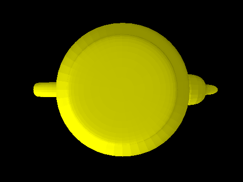
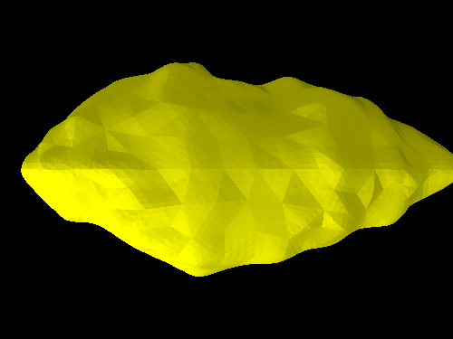

# [ccg-r3d](https://github.com/agdturner/ccg-r3d)
A Java library for rendering 3D spatial data. This is built on top of [ccg-v3d]((https://github.com/agdturner/ccg-v3d)) and uses [ccg-grids]((https://github.com/agdturner/ccg-grids))

Hello World!

Some success at rendering the Utah Teapot:

Running [RenderImage.java](src/main/java/uk/ac/leeds/ccg/r3d/RenderImage.java) produced this image in a few minutes on a basic desktop machine.

There are about 9000 triangles considered in the input data: [Utah_teapot_(solid).stl](data/Utah_teapot_(solid).stl).

Here is a rendering of [Geographos](https://en.wikipedia.org/wiki/1620_Geographos):

The plan is to use this library to help explain [ccg-v3d]((https://github.com/agdturner/ccg-v3d)) - the underlying 3D Euclidean geometry library, and also to generate basic rendering of objects. The longer term goal is to support the development and integration of Environmental Digital Twins.
